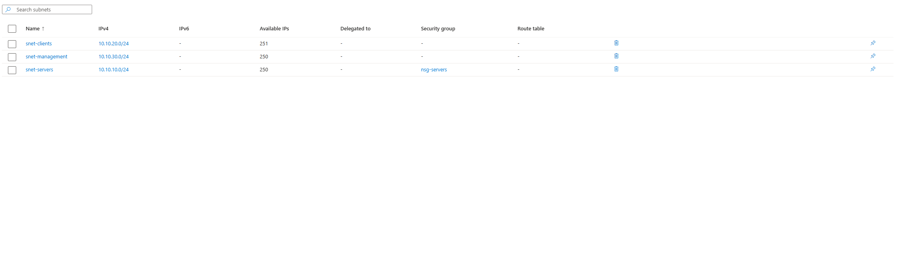

# Azure Cloud Infrastructure Lab

I built this lab to get some hands-on experience with Azure instead of only studying it from books and videos.

The idea was to build a small Azure network, separate different types of devices with subnets, deploy a couple Linux VMs, and figure out how to securely access them.

## Network Setup

I created a virtual network called `vnet-cloudlab` with three subnets:

| Subnet | Network | Purpose |
| --- | --- | --- |
| `snet-servers` | `10.10.10.0/24` | Servers |
| `snet-clients` | `10.10.20.0/24` | Client machines |
| `snet-management` | `10.10.30.0/24` | Management |

I wanted the network separated like something I would actually see in an enterprise environment instead of putting everything on one subnet.

## Virtual Machines

So far I have two Ubuntu Server 24.04 VMs.

### srv-linux-01

This is the internal server.

- Connected to `snet-servers`
- Private IP: `10.10.10.4`
- No public IP

I intentionally left this VM without a public IP because I don't want the server directly exposed to the internet.

### vm-mgmt-01

This is the management VM.

- Connected to `snet-management`
- Has a public IP
- Uses SSH key authentication
- SSH is restricted by a Network Security Group

The plan is to use this VM as the way into the environment and then manage internal systems from there.

## SSH and Network Security

I created an NSG rule that allows SSH on TCP port 22 to the management VM.

Originally the SSH rule was too open, so I changed the source to only allow my current public IP.

I also ran into a few problems creating the rule. Azure rejected it because of the source settings and rule priority, so I had to go back through the NSG configuration and fix those before the VM would deploy.

After fixing the rule, I was able to SSH into `vm-mgmt-01` from my Windows computer using the private key Azure generated.

## Cost

Both VMs are small lab VMs and I enabled auto-shutdown so I don't leave them running and burn through my Azure credits.

## What I Want To Do Next

The next step is to use `vm-mgmt-01` to SSH into `srv-linux-01` over the private Azure network.

After that I want to keep expanding the environment and eventually try rebuilding some of it with Terraform or Bicep.
